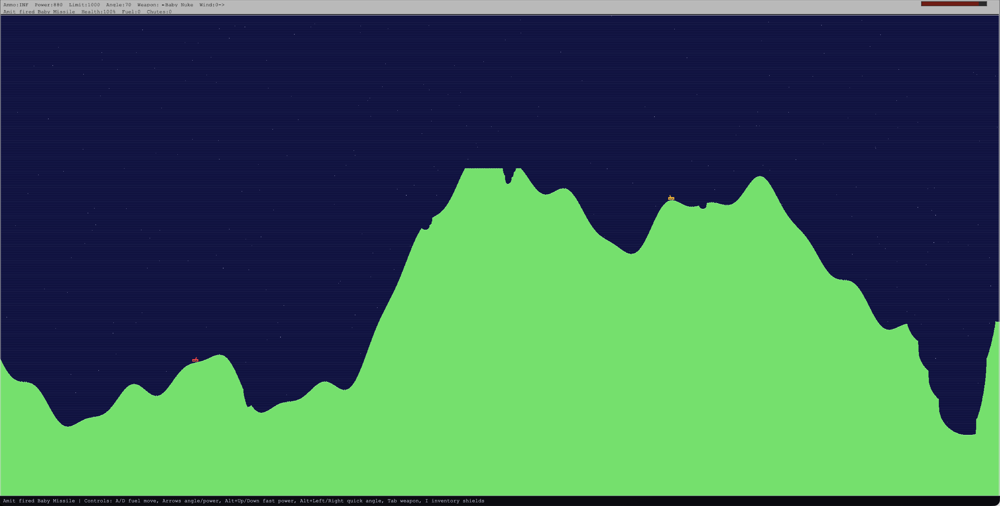

# Scorched Web

Scorched Web is a browser-based artillery game inspired by classic Scorched Earth gameplay. Players take turns aiming, choosing weapons, and firing across deformable terrain.



## Features

- Single-player and local play in the browser.
- LAN multiplayer via a signaling server.
- Built-in chat and lobby flow for LAN sessions.
- Portable Go server binaries with embedded web UI assets.

## LAN Multiplayer

The game supports LAN multiplayer using a WebSocket signaling server.

- Default server endpoint in the game UI: `127.0.0.1:8787`
- WebSocket path: `/ws`
- Health endpoint: `/health`

A host creates a room, other players join from the LAN endpoint, and the host starts the match when players are ready.

## Portable Embedded Server

The Go signaling server can also serve the game UI directly from embedded assets, so distribution is a single binary per platform.

### Build one local portable binary

```bash
make build-portable
```

Output:

- `dist/scorched`
- `server/signal-go/scorched`

### Build all portable binaries

```bash
make build-portable-all
```

Outputs in `dist/portable`:

- `scorched-windows-amd64.exe`
- `scorched-darwin-amd64`
- `scorched-darwin-arm64`
- `scorched-linux-amd64`
- `scorched-linux-arm64`

Unix binaries are built with executable permissions (`+x`).

### Run

```bash
./dist/scorched
```

By default the server listens on `0.0.0.0:8787` and attempts to open the default browser.

Environment variables:

- `PORT` (default `8787`)
- `HOST` (default `0.0.0.0`)
- `NO_BROWSER=1` to disable auto-open

## Development

```bash
make dev-ui
make dev-signal
make dev-all
```
